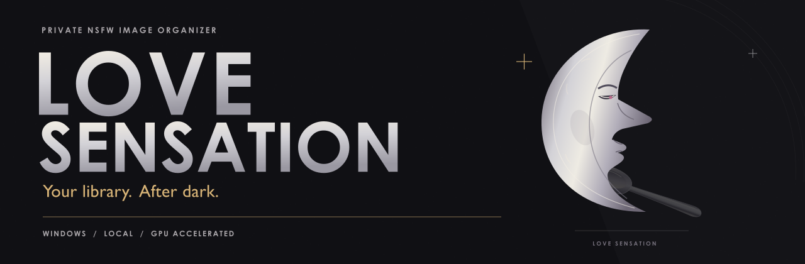
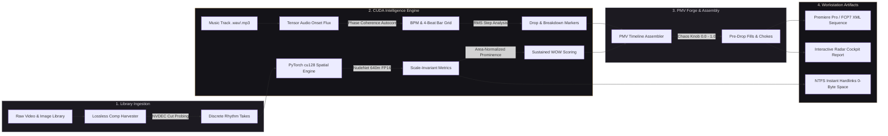
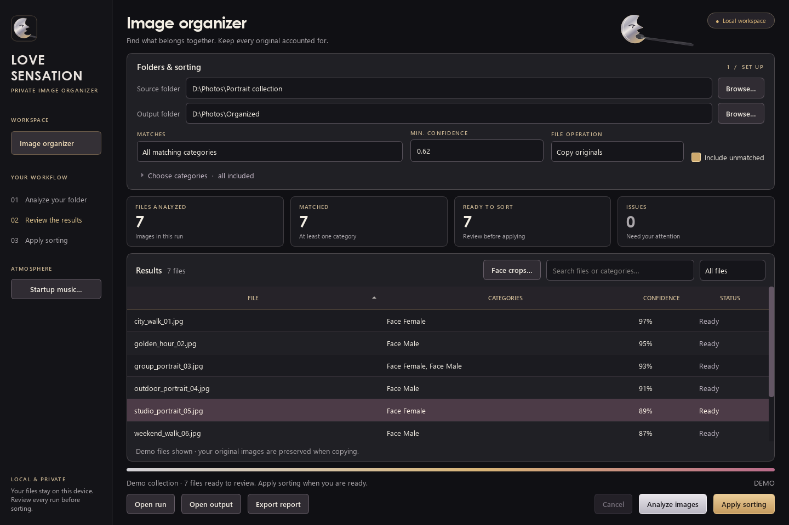
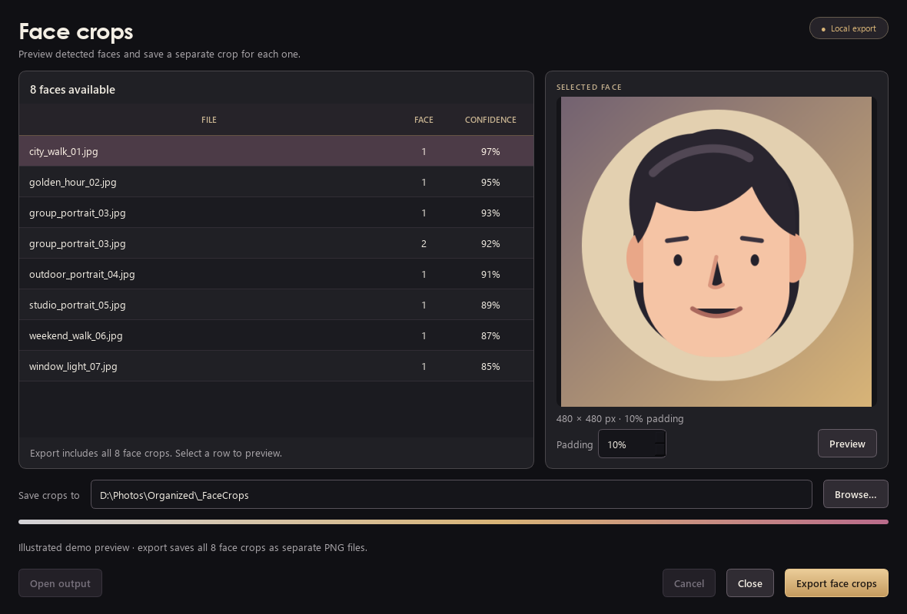

<p align="center">
  
</p>

<div align="center">

# L O V E &nbsp; S E N S A T I O N

### The Autonomous Media Workstation & PMV Forge for Windows 11

**Rhythm Intelligence. Scale-Invariant Neural Sorting. Zero Cloud Footprint.**<br>
*Engineered from the silicon up for local NVIDIA CUDA FP16 tensor compute.*

<p align="center">
  <a href="#quickstart"></a>
  
  
  <a href="https://github.com/coldbricks/love-sensation/actions/workflows/tests.yml"></a>
  <a href="LICENSE"></a>
</p>

<p align="center">
  <a href="#the-pillars">Workstation Pillars</a> &nbsp;•&nbsp;
  <a href="#the-pmv-forge">PMV Forge</a> &nbsp;•&nbsp;
  <a href="#compilation-harvester">Comp Harvester</a> &nbsp;•&nbsp;
  <a href="#quickstart">Quickstart</a> &nbsp;•&nbsp;
  <a href="#flight-report">Flight Report</a> &nbsp;•&nbsp;
  <a href="docs/USER_GUIDE.md">User Guide</a> &nbsp;•&nbsp;
  <a href="docs/DESIGN.md">Design Ethos</a>
</p>

</div>

---

> *"Massive private media libraries demand workstation-grade engineering, not fragile scripts or cloud uploads. Love Sensation couples hardware-accelerated computer vision, tensor-driven beat tracking, and professional NLE timeline assembly directly to your desktop."*

---

## Architecture at a Glance



---

## The Pillars

<div align="center">

| Pillar | Capability | Silicon Hot-Path |
| :--- | :--- | :--- |
| ⚡ **PMV Forge** | Frame-quantized music video assembly with drop detection, accelerating pre-drop fills, and blackout chokes. | CUDA Tensor Beat-Tracking & XML Generator |
| ✂️ **Comp Harvester** | Lossless scene-cut splitting for compilation videos into reusable rhythm takes without transcoding. | Hardware NVDEC Probing & FFmpeg Copy Stream |
| 👁️ **Scale-Invariant Vision** | Area-normalized prominence, aspect ratio profiling, and 85th-percentile sustained WOW scoring. | PyTorch cu128 FP16 NMS & Geometry Kernel |
| 🔗 **NTFS Hardlinking** | Instantaneous zero-copy file organization on Windows NTFS drives with 0 bytes of disk overhead. | Win32 `CreateHardLinkW` with Atomic Fallback |
| 🎛️ **Flight Report Cockpit** | Standalone zero-dependency HTML dashboard with SVG waveform radar, cut lanes, and ranked contact sheets. | Client-Side Vector SVG Radar Scope Engine |
| 🕶️ **Stealth Loupe & Panic** | Instant floating frosted glass inspection HUD on `Spacebar` / hover, with instant `Esc` panic screen wipe. | Hardware-Accelerated Qt Viewport Subsystem |

</div>

---

## The PMV Forge

The **PMV Forge** turns your sorted library into musical cinema. Ingest any soundtrack (`.mp3`, `.wav`, `.flac`, `.aac`) and let the CUDA audio engine discover the tempo, generate the 4-beat bar grid, and assemble high-prominence clips on the beat.



### Musical Assembly Grammar

- **Downbeat Anchors**: High-prominence media synced precisely to bar downbeat frames.
- **Pre-Drop Acceleration Fills**: The engine detects approaching energy peaks and triggers exponentially accelerating cuts ($1/2\text{ bar} \rightarrow 1/4\text{ bar} \rightarrow 1/8\text{ bar} \rightarrow \text{stutter}$).
- **Drop Downbeat Blackout Chokes**: Visual blackout choke directly preceding the drop impact, followed by peak sustained-WOW takes.
- **Breakdown Holds**: Ken Burns pan/zoom focal holds during quiet musical passages with smooth cross-dissolves.
- **The Chaos Knob (0.0 to 1.0)**:
  - `0.0`: Strict rhythmic repetition, steady tempo-locked cuts.
  - `0.5`: Balanced musical pacing with dynamic energy shifts.
  - `1.0`: Unpredictable montage variety and rhythmic micro-cuts.
- **NLE XML Sequence Export**: Generates frame-quantized Final Cut Pro 7 / Premiere Pro XML (`<xmeml version="4">`) with master file deduplication, cross-platform drive encoding, and timeline markers (`DROP`, `FILL`, `CHOKE`, `PEAK`, `OUTRO`).

---

## Compilation Harvester

Don't let multi-hour compilations sit in a folder unindexed. The **Comp Harvester** runs hardware-accelerated scene-cut thresholding across long videos to carve out continuous takes:

- **Lossless Stream-Copying**: Extracts scenes using `-c copy` directly into independent files in seconds without generational compression loss.
- **Rhythm-Ready Takes**: Each harvested take is cataloged with duration, resolution, frame rate, and geometric metrics, immediately ready for the PMV Forge.

---

## Scale-Invariant Spatial Intelligence

Raw confidence scores are misleading—a tiny peripheral element in the corner should never outrank a centered focal subject. Love Sensation implements scale-invariant geometric weighting:

$$\text{Prominence} = \text{Confidence} \times \sqrt{\frac{\text{Bounding Box Area}}{\text{Frame Area}}}$$

$$\text{Sustained Video WOW} = \text{Percentile}_{85}\left(\{\text{Frame Prominence Scores}\}\right)$$

- **Ken Burns Targeter**: Automatically extracts normalized $(x, y)$ focal coordinates to center pan and zoom keyframes on the subject.
- **Face Crop Studio**: Extract and export high-resolution face crops with customizable padding (0–30%) without touching source files.



---

## Zero-Copy NTFS Hardlink Engine

Organizing a 5 TB library used to mean waiting hours for file copies or risking folder moves. Love Sensation features native Windows NTFS hardlink integration:

- **Zero Additional Disk Space**: Creates hardlink filesystem pointers instantaneously. A 100 GB folder organizes in under one second.
- **Safety First**: Preserves immutable source files, executes Win32 `OPEN_REPARSE_POINT` handle validation, logs `.wal.jsonl` atomic write-ahead journals, and verifies SHA-256 hashes.
- **Seamless Cross-Volume Fallback**: If an output folder crosses physical drive boundaries, the engine seamlessly falls back to verified atomic streaming copy.

---

## Interactive Flight Report Cockpit

Every sorting run and PMV assembly can export an interactive, standalone HTML **Flight Report** (`report.html`):

- **Self-Contained**: 100% zero external CDN dependencies; renders entirely offline.
- **Vector Waveform Radar Scope**: Embedded SVG visualizer displaying audio energy, beat lines, and drop zones.
- **Cut Timeline Lane**: Interactive horizontal visualizer mapping every sequence cut to the underlying soundtrack.
- **Prominence-Ranked Media Grid**: Clickable contact sheets showing detected classes, aspect ratios, and focal points.

---

## Quickstart

### Hardware Requirements
- **OS**: Windows 11 (64-bit).
- **GPU**: NVIDIA GeForce RTX series GPU (RTX 5090 / 4090 / 3080 recommended; 24 GB / 16 GB VRAM).
- **Python**: 64-bit Python 3.12, 3.13, or 3.14.
- **CUDA Runtime**: NVIDIA Driver supporting CUDA 12.8+. *(Automatic CPU fallback is supported if CUDA is absent).*

### Installation

Open PowerShell in your desired directory:

```powershell
git clone https://github.com/coldbricks/love-sensation.git
cd love-sensation
powershell -NoProfile -ExecutionPolicy Bypass -File .\Setup.ps1
```

Double-click **`Launch Love Sensation.vbs`**, or run:

```powershell
.\.venv\Scripts\python.exe .\main.py
```

---

## Private by Design

- **100% Local Processing**: Zero cloud uploads, zero telemetry, zero analytics, zero external network calls.
- **Stealth Loupe**: Hold `Spacebar` or hover over any media card for an instant floating frosted glass loupe.
- **Panic Wipe**: Press `Esc` anywhere to instantly close previews and minimize/wipe the application from the desktop.
- **Excluded by Version Control**: All user media, detection caches (`data/`), model weights (`models/`), and export journals are strictly ignored by Git.

---

## Test & Verification Matrix

Validated locally on Windows 11 with an **NVIDIA GeForce RTX 5090 Laptop GPU (24 GB)**, Python 3.14, and PyTorch `cu128`:

```powershell
.\.venv\Scripts\python.exe -m pytest tests -q
# Result: 89 passed, 2 skipped, 13 subtests passed
```

| Verification Suite | Target | Status |
| :--- | :--- | :--- |
| `tests/test_metrics.py` | Area-normalized prominence, aspect ratios, sustained WOW | **Passed** |
| `tests/test_video_engine.py` | NVDEC probing, scene-cut thresholding, lossless stream-copy | **Passed** |
| `tests/test_audio_grid.py` | CUDA onset flux, Fourier phase coherence BPM lock, SVG waveform | **Passed** |
| `tests/test_pmv_forge.py` | XML master clip deduplication, drive `%3A` encoding, FCP7 DOM | **Passed** |
| `tests/test_hardlink.py` | Win32 `CreateHardLinkW` execution & copy fallback | **Passed** |
| `tests/test_flight_report.py` | Zero-dependency SVG cockpit report generation | **Passed** |
| `tools/verify_desktop.py` | Offscreen Qt workers, detection caching, verified SHA-256 | **Passed** |
| `tools/verify_crop_desktop.py` | 43 checks through Qt face-crop dialog on CUDA FP16 | **Passed** |
| `tools/verify_gpu.py` | RTX 5090 Laptop GPU FP16 tensor engine (>240 FPS) | **Passed** |

---

## License & Provenance

Application source is released under the [AGPL-3.0 License](LICENSE).  
Love Sensation utilizes PySide6, PyTorch, torchvision, Ultralytics, and the NudeNet 640m detector. Third-party components retain their respective licenses. Model weights are downloaded automatically on first run and are never committed to this repository. See [third-party notices](THIRD_PARTY.md) for full provenance records.
