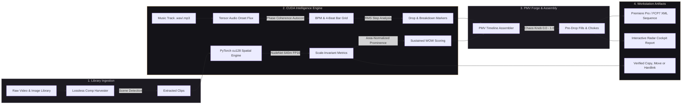

<p align="center">
  
</p>

<div align="center">

# L O V E &nbsp; S E N S A T I O N

### Local music-video editing and library tools for Windows 11

**Rhythm Intelligence. Scale-Invariant Neural Sorting. Zero Cloud Footprint.**<br>
*Engineered from the silicon up for local NVIDIA CUDA FP16 tensor compute.*

<p align="center">
  <a href="#quickstart"></a>
  
  
  <a href="https://github.com/coldbricks/love-sensation/actions/workflows/tests.yml"></a>
  <a href="LICENSE"></a>
</p>

<p align="center">
  <a href="#the-pillars">Workstation Pillars</a> &nbsp;•&nbsp;
  <a href="#the-pmv-forge">PMV Forge</a> &nbsp;•&nbsp;
  <a href="#compilation-harvester">Comp Harvester</a> &nbsp;•&nbsp;
  <a href="#quickstart">Quickstart</a> &nbsp;•&nbsp;
  <a href="#flight-report">Flight Report</a> &nbsp;•&nbsp;
  <a href="docs/USER_GUIDE.md">User Guide</a> &nbsp;•&nbsp;
  <a href="docs/DESIGN.md">Design Ethos</a>
</p>

</div>

---

> *"Massive private media libraries demand workstation-grade engineering, not fragile scripts or cloud uploads. Love Sensation couples hardware-accelerated computer vision, tensor-driven beat tracking, and professional NLE timeline assembly directly to your desktop."*

---

## Architecture at a Glance

The app now opens in **Create music video**: **Choose footage folder → Choose music → Build timeline → Export XML**. The footage picker is visible from the start, includes subfolders when selected, and reports loaded and skipped clips. No classification or sorting run is required. Review the cut list before exporting; source probing and export run in the background. **Library & sorting** remains available in the sidebar. XML output is an editable sequence; playback review and final movie rendering take place in your video editor.

### New in 2.1: Library & Review

Folder setup collapses after analysis, leaving a larger results workspace with an inspector. Include or skip individual files, select several rows for batch review, and correct categories without discarding the original model detections. Review choices persist in saved runs.

Press **Space** on a result to open an on-demand image/video preview. Press **Escape** to hide the workspace and owned Qt dialogs while work continues. Applying a run uses its full included set, independent of the current search filter.

This release also fixes source-dimension normalization, sampled-video error states and caching, Forge startup and timing bounds, frame-rate labels, and safe repeat Harvester output. See the [current user guide](docs/USER_GUIDE.md) for the complete workflow and limitations. BeatEdit marker import remains future work.



---

## The Pillars

<div align="center">

| Pillar | Capability | Silicon Hot-Path |
| :--- | :--- | :--- |
| ⚡ **PMV Forge** | Frame-quantized sequence assembly using an estimated four-beat bar grid and validated source bounds. | CUDA audio analysis; XML export |
| ✂️ **Comp Harvester** | Scene extraction with fast copy or accurate re-encoded cuts and measured output metadata. | FFmpeg; NVENC-first accurate encoding |
| 👁️ **Scale-Invariant Vision** | Area-normalized prominence, aspect ratio profiling, and 85th-percentile sustained WOW scoring. | PyTorch cu128 FP16 NMS & Geometry Kernel |
| 🔗 **NTFS Hardlinking** | Shared-data file organization, with hash verification and independent-copy fallback where needed. | Win32 `CreateHardLinkW` with verified copy fallback |
| 🎛️ **Flight Report Cockpit** | Standalone zero-dependency HTML dashboard with SVG waveform radar, cut lanes, and ranked contact sheets. | Client-Side Vector SVG Radar Scope Engine |
| 🕶️ **Private review** | On-demand previews on Space and a workspace/dialog shield on Escape. | CUDA preview processing and Qt interface |

</div>

---

## The PMV Forge

The **PMV Forge** turns your sorted library into musical cinema. Ingest any soundtrack (`.mp3`, `.wav`, `.flac`, `.aac`) and let the CUDA audio engine discover the tempo, generate the 4-beat bar grid, and assemble high-prominence clips on the beat.


### Musical Assembly Grammar

- **Estimated bar anchors**: Clips align to a four-beat grid. Tempo and bar phase require creative review.
- **Fill subdivisions**: Additional cuts can subdivide selected bars; boundaries are constrained to source footage and song duration.
- **Section tags**: Drop/fill/choke labels describe the generated plan. A choke tag does not itself render a blackout effect.
- **Breakdown holds**: Longer holds and dissolve elements are supported. Automated Ken Burns animation is not authored by the XML exporter.
- **The Chaos Knob (0.0 to 1.0)**:
  - `0.0`: Strict rhythmic repetition, steady tempo-locked cuts.
  - `0.5`: Balanced musical pacing with dynamic energy shifts.
  - `1.0`: Unpredictable montage variety and rhythmic micro-cuts.
- **NLE XML Sequence Export**: Generates frame-quantized Final Cut Pro 7 / Premiere Pro XML (`<xmeml version="4">`) with master file deduplication, cross-platform drive encoding, and timeline markers (`DROP`, `FILL`, `CHOKE`, `PEAK`, `OUTRO`).

---

## Compilation Harvester

Don't let multi-hour compilations sit in a folder unindexed. The **Comp Harvester** runs hardware-accelerated scene-cut thresholding across long videos to carve out continuous takes:

- **Lossless Stream-Copying**: Extracts scenes using `-c copy` directly into independent files in seconds without generational compression loss.
- **Measured take metadata**: Each take records its actual duration, dimensions and frame rate. Open the extracted folder in Library & Review and analyze it before supplying its results to Forge.
- **Accurate mode**: Re-encodes at requested boundaries with NVENC when available. Fast stream copy can preserve keyframe preroll.
- **Separate run folders**: Repeated extraction never reuses the previous run's output paths.

---

## Scale-Invariant Spatial Intelligence

Covered buttocks also use a local **SigLIP 2 SO400M** image classifier alongside NudeNet. This helps recognize clothed rear views and close, distorted camera views that the region detector can miss. Select **Buttocks Covered** to include these matches. NudeNet's confidence threshold remains unchanged; the additional classifier compares fixed covered-body descriptions with competing descriptions and requires a positive logit margin. A margin is not a confidence percentage.

Image matches are labeled **Region not localized** when there is no qualifying detection box. They do not provide a body outline, skeleton, pose, prominence, or aspect measurement. For videos, the matching sample time is retained; sampling is still capped at 24 frames per clip and can miss brief appearances. Minimum geometry filters exclude matches without measured geometry.

Both models run locally, defaulting to CUDA FP16 when available. First-time setup downloads about 4.6 GB of additional public model files and verifies their hashes. Subsequent inference loads those files offline. Private images, embeddings, and model outputs are not sent to a remote inference service. The model and prompt revision are part of the analysis-cache identity, so earlier NudeNet-only results are reanalyzed.

The initial local acceptance set passed 32 of 32 user-confirmed covered-body examples and rejected nine background, synthetic, and frontal-upper-body controls. This small set establishes those examples' image-level recognition, not general accuracy or localization quality. The private test images are not included in this repository. The earlier NudeNet-only throughput numbers below do not apply to the combined pipeline.

Raw confidence scores are misleading—a tiny peripheral element in the corner should never outrank a centered focal subject. Love Sensation implements scale-invariant geometric weighting:

$$\text{Prominence} = \text{Confidence} \times \sqrt{\frac{\text{Bounding Box Area}}{\text{Frame Area}}}$$

$$\text{Sustained Video WOW} = \text{Percentile}_{85}\left(\{\text{Frame Prominence Scores}\}\right)$$

- **Saved geometry**: Preserves detection boxes and representative video timestamps for inspection; this does not automatically create pan/zoom keyframes.
- **Face Crop Studio**: Extract and export high-resolution face crops with customizable padding (0–30%) without touching source files.


---

## Zero-Copy NTFS Hardlink Engine

Organizing a 5 TB library used to mean waiting hours for file copies or risking folder moves. Love Sensation features native Windows NTFS hardlink integration:

- **Shared file data**: Hardlinks avoid duplicating file contents on a supported volume. Hash verification still reads the data, and filesystem metadata uses space.
- **Verified operations**: Uses handle validation, `.wal.jsonl` recovery journals and SHA-256 verification. Hardlinks remain writable aliases: editing either path changes the same data. Use Copy for independent files.
- **Seamless Cross-Volume Fallback**: If an output folder crosses physical drive boundaries, the engine seamlessly falls back to verified atomic streaming copy.

---

## Interactive Flight Report Cockpit

Every sorting run and PMV assembly can export an interactive, standalone HTML **Flight Report** (`report.html`):

- **Self-Contained**: 100% zero external CDN dependencies; renders entirely offline.
- **Vector Waveform Radar Scope**: Embedded SVG visualizer displaying audio energy, beat lines, and drop zones.
- **Cut Timeline Lane**: Interactive horizontal visualizer mapping every sequence cut to the underlying soundtrack.
- **Media catalog**: Metadata cards showing names, review state and model metrics; media playback is not embedded.

---

## Quickstart

### Hardware Requirements
- **OS**: Windows 11 (64-bit).
- **GPU**: NVIDIA GeForce RTX series GPU (RTX 5090 / 4090 / 3080 recommended; 24 GB / 16 GB VRAM).
- **Python**: 64-bit Python 3.12, 3.13, or 3.14.
- **CUDA Runtime**: NVIDIA Driver supporting CUDA 12.8+. *(Automatic CPU fallback is supported if CUDA is absent).*

### Installation

Open PowerShell in your desired directory:

```powershell
git clone https://github.com/coldbricks/love-sensation.git
cd love-sensation
powershell -NoProfile -ExecutionPolicy Bypass -File .\Setup.ps1
```

Double-click **`Launch Love Sensation.vbs`**, or run:

```powershell
.\.venv\Scripts\python.exe .\main.py
```

---

## Private by Design

- **Local media processing**: Media stays on the device. Initial setup can download dependencies and the verified detector model.
- **On-demand previews**: Press Space on a focused result to toggle its preview. No hover reveal or disk thumbnail cache.
- **Privacy shield**: Escape conceals the workspace and owned Qt dialogs. Resume explicitly restores them, with previews closed. External browsers and editors are separate applications.
- **Excluded by Version Control**: All user media, detection caches (`data/`), model weights (`models/`), and export journals are strictly ignored by Git.

---

## Test & Verification Matrix

Validated locally on Windows 11 with an **NVIDIA GeForce RTX 5090 Laptop GPU (24 GB)**, Python 3.14, and PyTorch `cu128`:

```powershell
.\.venv\Scripts\python.exe -m pytest tests -q
# Result: 89 passed, 2 skipped, 13 subtests passed
```

| Verification Suite | Target | Status |
| :--- | :--- | :--- |
| `tests/test_metrics.py` | Area-normalized prominence, aspect ratios, sustained WOW | **Passed** |
| `tests/test_video_engine.py` | NVDEC probing, scene-cut thresholding, lossless stream-copy | **Passed** |
| `tests/test_audio_grid.py` | CUDA onset flux, Fourier phase coherence BPM lock, SVG waveform | **Passed** |
| `tests/test_pmv_forge.py` | XML master clip deduplication, drive `%3A` encoding, FCP7 DOM | **Passed** |
| `tests/test_hardlink.py` | Win32 `CreateHardLinkW` execution & copy fallback | **Passed** |
| `tests/test_flight_report.py` | Zero-dependency SVG cockpit report generation | **Passed** |
| `tools/verify_desktop.py` | Offscreen Qt workers, detection caching, verified SHA-256 | **Passed** |
| `tools/verify_crop_desktop.py` | 43 checks through Qt face-crop dialog on CUDA FP16 | **Passed** |
| `tools/verify_gpu.py` | RTX 5090 Laptop GPU FP16 tensor engine (>240 FPS) | **Passed** |

---

## License & Provenance

Application source is released under the [AGPL-3.0 License](LICENSE).  
Love Sensation utilizes PySide6, PyTorch, torchvision, Ultralytics, Transformers, the NudeNet 640m detector, and Google's SigLIP 2 SO400M model. Third-party components retain their respective licenses. Model weights are downloaded automatically on first run and are never committed to this repository. See [third-party notices](THIRD_PARTY.md) for full provenance records.
